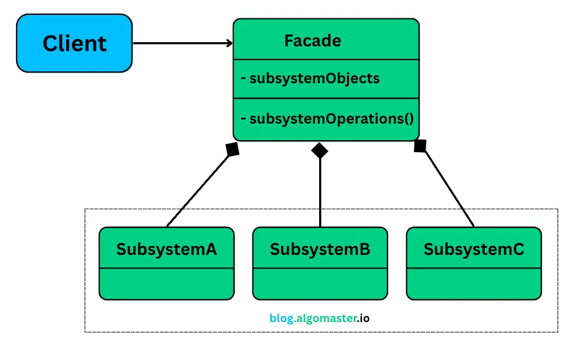

# Facade Design Pattern

The **Facade** design pattern provides a simplified interface to a complex subsystem. It defines a higher-level interface that makes the subsystem easier to use.

## Real-World Analogy
Think of a high-end hotel. As a guest (the client), you don't want to individually contact housekeeping for a fresh towel, the restaurant for dinner reservations, and the valet for your car. Instead, you call the Concierge Desk (the Facade).

You make a simple request to the concierge, like "I'd like dinner reservations at 8 PM and my car ready afterwards." The concierge then interacts with all the necessary hotel departments (the subsystem) to fulfill your request.

You, as the guest, are shielded from this internal complexity. The Concierge Desk provides a simplified interface to the hotel's services.

## Intent

- Hide the complexities of the system.
- Provide a unified interface to a set of interfaces in a subsystem.

## Structure

```
Client --> Facade --> Subsystem Classes
```

## When to Use

- When you want to provide a simple interface to a complex subsystem.
- When there are many dependencies between clients and the implementation classes of an abstraction.

## Example

Suppose you have a home theater system with multiple components (DVD player, projector, lights). The Facade pattern allows you to control all components with a single interface.

```python
class HomeTheaterFacade:
    def __init__(self, dvd, projector, lights):
        self.dvd = dvd
        self.projector = projector
        self.lights = lights

    def watch_movie(self, movie):
        self.lights.dim()
        self.projector.on()
        self.dvd.play(movie)
```

## Benefits

- Reduces complexity for clients.
- Decouples subsystems from clients.
- Promotes loose coupling.

## Drawbacks

- Facade can become a god object if it grows too large.
- May limit flexibility for advanced users.

## Related Patterns

- **Adapter**: Converts one interface to another.
- **Mediator**: Coordinates communication between objects.

---

**References:**
- [Refactoring Guru - Facade](https://refactoring.guru/design-patterns/facade)
- [GoF Design Patterns](https://en.wikipedia.org/wiki/Facade_pattern)
- [Algomaster](https://blog.algomaster.io/p/aa8096d1-9fec-470c-b1ef-aade9ee7e199)
